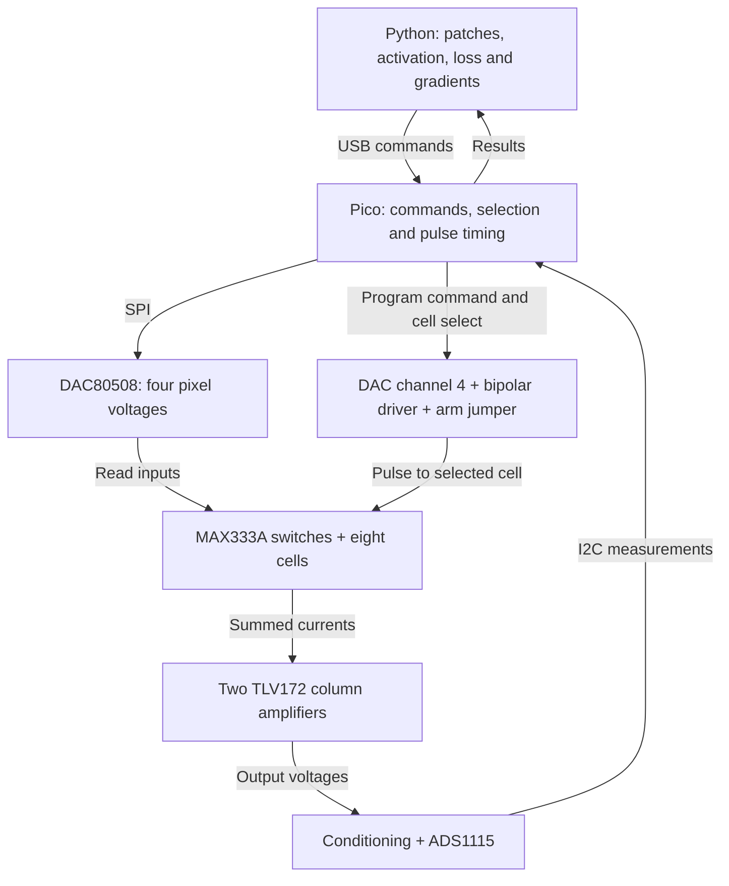

# Memristor CNN

Last semester in my KiCad class, I worked on a project that used different resistor weights to distinguish sine, square, and spiky triangular waves. I took four snapshots of each signal, formed a weighted sum, and used some hard-coded `if / else` rules to decide which waveform it could be. If the result fell outside an expected range, I could rule out a particular wave. Hand-wavy explanation, but it felt a little like a neural network.

The major takeaway was that I did not have to do the weighted addition in software. The resistor network and Kirchhoff's current law did it electrically. Last summer, I came across a reel about using the same idea for efficient matrix multiplication. I started digging, learned about memristors—devices whose resistance can be programmed and retained—and found [*Memristor-Based Artificial Neural Networks for Hardware Neuromorphic Computing*](https://doi.org/10.34133/research.0758).

That got me learning about CNNs and memristors, with the textbook neural-network goal: yes, recognize handwritten digits. This repository records the circuit and calculations as I work toward that.

## Where it stands

The current design is a **four-input, two-output analog multiply-and-sum circuit**, with eight individually selectable cells. The schematic and simplified circuit simulations are complete for this stage. Physical assembly, Pico firmware, closed-loop device programming, and handwritten-digit recognition are still ahead.

- [Schematic PDF — three sheets, Rev B](docs/schematic-rev-b.pdf)
- [Hardware details and signal mapping](docs/hardware.md)
- [Runnable circuit checks and their limits](simulation/README.md)

The PDF is the published schematic deliverable; editable KiCad files are omitted here. A connectivity export is included so the Python circuit checks remain reproducible.

## The CNN math

A convolutional filter slides across an image and computes a weighted sum at each position:

$$
y_j(r,c)=\sum_{u=0}^{1}\sum_{v=0}^{1}w_j(u,v)x(r+u,c+v)+b_j.
$$

Flatten one grayscale $2\times2$ patch into four inputs. With two filters, the calculation becomes $\mathbf y=W\mathbf x$ before bias and activation:

```math
\underbrace{
\begin{bmatrix}
1 & 1 & 0.5 & 0.5 \\
0.5 & 0.5 & 1 & 1
\end{bmatrix}
}_{W}
\underbrace{
\begin{bmatrix}
1 \\
0.5 \\
0.5 \\
0.5
\end{bmatrix}
}_{\mathbf{x}}
=
\begin{bmatrix}
2 \\
1.75
\end{bmatrix}.
```

Repeating this for successive patches builds two feature maps. Bias, activation, pooling, and classification are planned software operations initially. The present circuit implements the weighted sums, not a complete CNN.

## Connecting the math to electronics

At a small read voltage, model each cell as a resistance $R$. Ohm's law supplies multiplication; Kirchhoff's current law supplies addition:

$$
G_{ij}=\frac{1}{R_{ij}},\qquad I_{ij}=V_iG_{ij},\qquad I_j=\sum_i V_iG_{ij}.
$$

A mathematical weight is **proportional to conductance**. To keep units consistent, use $w_{ji}=G_{ij}/G_0$, with $G_0=1/(60\,\mathrm{k}\Omega)$. Thus $60\,\mathrm{k}\Omega$ represents weight 1 and $120\,\mathrm{k}\Omega$ represents weight 0.5. The array indices are input row $i$, output column $j$; the weight matrix has outputs as rows.

Encode inputs as $V_i=\alpha x_i$, where $\alpha=0.2\,\mathrm V$. Each column feeds an inverting transimpedance amplifier with $R_f=10\,\mathrm{k}\Omega$:

$$
V_{\mathrm{out},j}=-R_f I_j=-R_f\alpha G_0y_j.
$$

For the example above, the inputs are $[0.2,0.1,0.1,0.1]\,\mathrm V$ and the ideal outputs are **−66.67 mV and −58.33 mV**. The minus sign comes from the amplifier; it does not represent a negative stored weight.

| Circuit section | Calculation |
| --- | --- |
| DAC input conversion | $V_i=2.5D_i/65536$ for the configured 16-bit, 2.5 V range |
| Cell and read switch | $I_{ij}\approx V_i/(R_{ij}+R_{\mathrm{sw},ij})$ |
| Column amplifier | $V_{\mathrm{out},j}=-R_f\sum_i I_{ij}$ |
| ADC conditioning | $V_{\mathrm{ADC},j}=0.25V_{\mathrm{out},j}+1.875\,\mathrm V$ |
| Differential measurement | $V_{\mathrm{out},j}=4(V_{\mathrm{ADC},j}-V_{\mathrm{BASE}})$, with $V_{\mathrm{BASE}}=1.875\,\mathrm V$ |
| Programming driver | $V_{\mathrm{driver}}=2V_{\mathrm{CMD}}-2.5\,\mathrm V$ |

The computation still uses energy and takes time to settle. Whether the complete system saves energy depends on the DACs, ADC, amplifiers, data transfer, and programming overhead—not just the array.

## Architecture

The diagram shows the intended operating loop. The hardware blocks are drawn in the schematic; host software and firmware are not implemented yet.



In read mode, each of the four pixel voltages feeds one cell in each column. In write mode, a switch routes the programming bus to one selected cell while the other pixel inputs are held at zero.

The planned learning loop is:

$$
w^{\mathrm{new}}=w-\eta\frac{\partial L}{\partial w},\qquad
R^{\mathrm{target}}=\frac{1}{G_0w^{\mathrm{new}}}.
$$

For example, increasing a weight from 1 to 1.1 means reducing its target resistance from 60 kΩ to about 54.55 kΩ. A pulse does not directly set an exact resistance: the controller must **pulse, read, compare, and repeat** within the device's supported conductance range. Pulse polarity and duration must be established for the selected physical device.

## What has been checked

- The Rev B redraw preserved all **74 electrical nets** and all **86 physical component values and footprints** from Rev A.
- The original validation checked **36 explicit connectivity conditions** and **17 simplified ngspice DC cases**: one read case and both programming polarities for each of eight selected cells.
- With an assumed 50 Ω switch resistance, the simulated read outputs were **−66.6181 mV and −58.2952 mV**, consistent with the resistor calculation.

These are topology and DC checks using fixed cell resistances and idealized active devices. They do not establish memristor switching behavior, transient stability, classification accuracy, or measured energy savings. A specific physical memristor has not been selected.

## Run the calculations

Python 3.10+; no Python packages required. Install ngspice separately for the DC simulation.

```bash
python3 simulation/read_example.py
python3 simulation/check_circuit.py --connectivity-only
python3 simulation/check_circuit.py
```

`read_example.py` reproduces the matrix product and voltage conversions. `check_circuit.py` checks the exported wiring and builds simplified ngspice circuits from it. Neither script communicates with a Pico or trains a CNN. See [the code guide](simulation/README.md) for assumptions and output files.

## Next iterations

- **Build and characterize:** verify the interfaces with fixed resistors, then select real devices and measure read disturbance, retention, programming variability, and required current compliance.
- **Close the training loop:** implement Pico firmware, Python communication, calibration, and pulse/read/verify updates.
- **Support negative weights:** use differential conductance pairs, $w\propto G^+-G^-$. Keeping two signed four-input filters would require 16 cells rather than eight.
- **Move more work onto the board:** start with patch sequencing and local control on the Pico, then evaluate hardware activation or other operations now planned for Python.
- **Improve efficiency:** measure converter latency, settling, transfer overhead, and energy per inference before choosing faster readout or a larger array.
- **Recognize digits and compare:** establish a software CNN baseline on MNIST, then compare the hybrid system using the same data split and preprocessing. Report accuracy, end-to-end latency, and full-system energy; there are no digit-recognition results yet.

## Contributing

If you want to contribute, reach out to [Sebish Niraula on LinkedIn](https://www.linkedin.com/in/sebish-niraula-5b9782303/). Device characterization, analog design, firmware, and reproducible benchmarking would all be useful.

## References

- Jin et al., [*Memristor-Based Artificial Neural Networks for Hardware Neuromorphic Computing*](https://doi.org/10.34133/research.0758), Research, 2025. [Open-access text](https://pmc.ncbi.nlm.nih.gov/articles/PMC12231232/). This review motivated the project; the circuit is an educational prototype, not a reproduction of a specific published system.
- [DAC80508](https://www.ti.com/lit/ds/symlink/dac80508.pdf), [MAX333A](https://www.analog.com/media/en/technical-documentation/data-sheets/MAX333A.pdf), [TLV172](https://www.ti.com/lit/ds/symlink/tlv172.pdf), [TLV9004](https://www.ti.com/lit/ds/symlink/tlv9004.pdf), [ADS1115](https://www.ti.com/lit/ds/symlink/ads1115.pdf), and [Raspberry Pi Pico](https://datasheets.raspberrypi.com/pico/pico-datasheet.pdf) datasheets.
